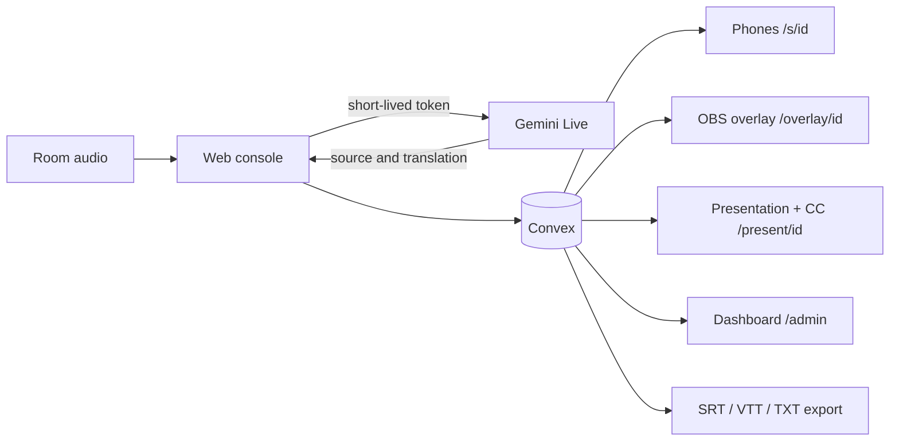

# LinguaStream

[Versión en español](README.md)

**Live demo:** https://linguastream-ten.vercel.app · the `/admin` panel has an **Enter as demo** button (up to 3 live rooms, 20 minutes per session).

Live captions and translation for conferences, built with Next.js, Convex, and Gemini Live. Each room sends audio from a web console; attendees receive text in real time on their phones, while production can add the same captions to a projector, OBS, vMix, or the event stream.

The project operates several talks without exposing the Gemini API key to room laptops. Convex mints short-lived tokens, stores finalized lines, and distributes live updates.

## What is included

- A room console with microphone or browser-tab audio, a level meter, pause, and automatic reconnect.
- Original captions and Spanish, English, and Portuguese translations.
- Entry by QR or 4-letter code, with a popup to pick a language (Español, English, Português) or the accessible mode.
- An accessible mode for deaf and hard-of-hearing people (see [Accessibility](#accessibility)).
- Read-aloud of the translation that always stays live: when it falls behind it drops old lines instead of queueing them.
- Conferences grouping sessions and isolated conference/session glossaries. Glossaries can be extracted with AI from the talk's slides (PDF or Google Slides link).
- A production dashboard with a funnel (live, with problems, scheduled, finished), live alerts, state, elapsed time, latency, errors, lines, and an estimate of connected web viewers. Finished talks are filed in an archive folder with per-language downloads.
- A transparent OBS/vMix overlay and a presentation-plus-CC output.
- TXT, SRT, and WebVTT exports.

## Architecture



The implementation opens one Gemini connection per target language. The first connection also provides source-language transcription. This distinction matters when estimating capacity and cost.

## Requirements

- Node.js 22 and npm 10 or newer.
- A [Convex](https://www.convex.dev/) account and project.
- A [Gemini Developer API](https://ai.google.dev/gemini-api/docs/api-key) key.
- Chrome or Edge for audio and display capture.

## Local setup

```bash
git clone https://github.com/Letalc/LinguaStream.git
cd LinguaStream
npm install
npx convex dev
```

The first Convex run asks you to sign in and select or create a project. It also writes `NEXT_PUBLIC_CONVEX_URL` to `.env.local`. In another terminal, configure the development deployment secrets:

```bash
npx convex env set ADMIN_PASSWORD
npx convex env set GEMINI_API_KEY
```

The CLI prompts for each value, so it does not need to be committed. Never place a real key in a tracked file. To make QR links work on a phone on the same network, add an address that the phone can reach:

```dotenv
NEXT_PUBLIC_PUBLIC_URL=http://192.168.1.50:3000
```

Start the app:

```bash
npm run dev
```

Open `http://localhost:3000/admin`, enter the password, create a conference, then create a session. Each room console is available at `/console/[sessionId]`.

## Deploy

The public instance runs on **Vercel** (frontend) and **Convex Cloud** (backend):

```bash
# 1. Backend: push functions, schema, and crons to the production deployment
npx convex env set --prod ADMIN_PASSWORD
npx convex env set --prod GEMINI_API_KEY
npx convex env set --prod DEMO_MODE true   # optional: enables the "Enter as demo" button
npx convex deploy

# 2. Frontend: a Vercel project connected to the repository
vercel env add NEXT_PUBLIC_CONVEX_URL production       # https://<deployment>.convex.cloud
vercel env add NEXT_PUBLIC_CONVEX_SITE_URL production  # https://<deployment>.convex.site
vercel --prod
```

`vercel.json` pins the framework to Next.js. With the repository connected, every push to `master` publishes the frontend; the backend is pushed separately with `npx convex deploy` (before the push when `convex/` changes). `NEXT_PUBLIC_PUBLIC_URL` is not needed in production: QR codes use the site's own domain.

## Accessibility

After scanning the QR, attendees pick their language or **Accessible · deaf or hard of hearing**. The accessible mode offers:

- Very large [Atkinson Hyperlegible](https://www.brailleinstitute.org/freefont/) text, 3 high-contrast color schemes, and focus on the last 3 lines.
- **Pause to re-read** the whole talk and return to live with one tap.
- A visual **Speaking / Silence** indicator plus paused, ended, and reconnecting notices, so a still screen is never ambiguous.
- A **sign-language interpreter** video: the room console accepts a link (YouTube or any embeddable page) and attendees see it above the captions. It is a human interpreter provided by the event, not AI-generated.
- **Vibration** when the talk starts, pauses, and ends (Android; iOS Safari does not allow web vibration).

## Running several rooms

- From the dashboard, **Consola** opens each room in its **own window** and the dashboard stays in its tab. Clicking it again focuses that window without reloading it.
- The console captures the audio and holds the Gemini connections: closing it ends the talk. While live, **← Panel** opens the dashboard in another tab, and closing or reloading asks for confirmation.
- Allow pop-ups for the site on the production browser. Keep each console in a visible window (not a hidden tab), because browsers throttle background tabs.
- Pick the right **Habla en** (spoken language) when creating the session: if the speaker talks in Spanish and the session says English, Gemini cannot translate Spanish into Spanish and that language stays empty.

## Audience and production outputs

Each room's QR dialog offers three outputs. Pick by where the text will be seen:

| Option | What it shows | For whom |
| --- | --- | --- |
| **Proyectar en pantalla** (project on screen) | The room QR and code | So the audience can join from their phones |
| **Presentación + CC** (presentation + CC) | The slides with captions on top | The room's big screen: attendees read slides and translation together, deaf and hard-of-hearing people follow without a phone, and production can capture it for the stream |
| **Overlay OBS/vMix** | Captions only, on a transparent background | Streaming technicians who already mix camera and slides |


- `/s/[sessionId]`: personal view for phones and computers.
- `/share/[sessionId]`: room QR and code for a projector.
- `/present/[sessionId]` (**Presentation + CC**): open it on the projector computer, click **Elegir presentación** (choose presentation), select the slides window (PowerPoint, Keynote, Google Slides), then **Pantalla completa** (full screen). The page shows the slides with captions on top; switch the language at the top. The room console must be streaming.
- `/overlay/[sessionId]?lang=en&size=42&lines=2&bg=1`: transparent OBS/vMix Browser Source. Use `bg=0` to remove the box and `color=ffffff` for a hexadecimal text color.

For a stream combining camera and slides, production mixes those sources in OBS/vMix and adds `/overlay/...` as a Browser Source. The app cannot control the CC button of an unknown third-party platform; that requires caption-track support from that platform. The overlay burns captions into the video so every viewer can see them.

## Docker

Docker runs the frontend against an existing Convex deployment; it does not replace the managed Convex backend.

```bash
cp .env.example .env.local
# fill in the public variables
docker compose --env-file .env.local up --build
```

Configure `ADMIN_PASSWORD` and `GEMINI_API_KEY` with `npx convex env set`; they are never included in the image.

## Tests

```bash
npm test          # requires Node.js 22 (vitest does not start on Node 20.17)
npm run lint
npx tsc --noEmit
npm run build
```

The local suite simulates 3 and 10 isolated rooms, 30 minutes with drops every five minutes, console takeover, EN/ES/PT, partial/final lines, and glossaries. It uses virtual time and a fake Gemini transport: it proves application behavior, not provider latency or availability. See [docs/VALIDATION.md](docs/VALIDATION.md) for the full matrix.

## Real-service testing and cost

`scripts/simulate-room.ts` accepts 16 kHz mono WAV files and uses the real services:

```bash
ADMIN_PASSWORD='...' npx tsx scripts/simulate-room.ts talk-en.wav:en:es talk-es.wav:es:en,pt
```

`DROP=1` forces a reconnect. Each file opens another room, and every target language opens another Gemini connection, so this test can incur paid usage. Review the budget before running it.

As of September 25, 2026, Google lists an approximate effective price of **USD 0.0368 per minute per connection** for `gemini-3.5-live-translate-preview`: about **USD 2.21 per hour with one target language** or **USD 4.42 per hour with two**. Always verify the [official pricing page](https://ai.google.dev/gemini-api/docs/pricing), because this is a preview model. Convex, data transfer, and streaming costs are separate.

### Gemini quota: how many rooms at once

Each room opens **one Gemini Live connection per target language**, so an EN → ES + PT room uses 2 connections. Gemini limits **concurrent Live sessions per project** according to the account tier:

- **Tested:** 3 simultaneous rooms for 30 minutes, with 6 forced reconnections per room and no quota errors ([result](test-results/real-3-room-30m-2026-09-25.md)).
- **Console notice:** `Resource has been exhausted (e.g. check quota)` means Gemini rejected a connection because of quota; the console retries on its own and the notice turns grey once it recovers.
- **Observed limit:** with 10 rooms, Gemini rejected part of the connections (WebSocket 1011) because of the project's concurrent quota ([log](test-results/real-load-2026-09-25.json)).

For an event with more rooms: check your project's limits in [Google AI Studio](https://aistudio.google.com/) → Rate limits, request a quota increase or move to a higher billing tier, and run a staged test before the event.

## Scale and audience count

The count represents browsers connected to the web audience view; it excludes people watching video with burned-in captions. It is an operational signal, not a unique-attendee count. Before a large conference, load-test the selected plan and review the [Convex limits](https://docs.convex.dev/production/state/limits). Total event attendance is not the same as concurrent app connections.

## Project status

Deployed and validated against real services: EN → ES/PT and ES → EN, ~1 s latency for the original and ~2.5 s for the translation after each sentence, 3 rooms for 30 minutes with reconnections, room isolation, and an SRT export opened in VLC. Details in [docs/VALIDATION.md](docs/VALIDATION.md). The number of simultaneous rooms depends on the Gemini quota (see above).

Licensed under the [MIT License](LICENSE).
