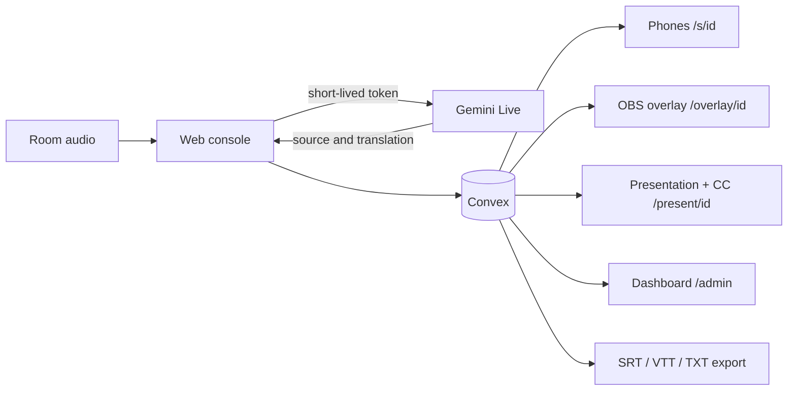

# LinguaStream

[Versión en español](README.md)

Live captions and translation for conferences, built with Next.js, Convex, and Gemini Live. Each room sends audio from a web console; attendees receive text in real time on their phones, while production can add the same captions to a projector, OBS, vMix, or the event stream.

The project operates several talks without exposing the Gemini API key to room laptops. Convex mints short-lived tokens, stores finalized lines, and distributes live updates.

## What is included

- A room console with microphone or browser-tab audio, a level meter, pause, and automatic reconnect.
- Original captions and Spanish, English, and Portuguese translations.
- An accessible view with font sizing, contrast, speech playback, and a sign-language interpreter link.
- Conferences grouping sessions and isolated conference/session glossaries.
- A production dashboard showing state, latency, errors, lines, and an estimate of connected web viewers.
- A transparent OBS/vMix overlay and a presentation-plus-CC output.
- TXT, SRT, and WebVTT exports.

## Architecture



The implementation opens one Gemini connection per target language. The first connection also provides source-language transcription. This distinction matters when estimating capacity and cost.

## Requirements

- Node.js 22 and npm 10 or newer.
- A [Convex](https://www.convex.dev/) account and project.
- A [Gemini Developer API](https://ai.google.dev/gemini-api/docs/api-key) key.
- Chrome or Edge for audio and display capture.

## Local setup

```bash
git clone https://github.com/Letalc/LinguaStream.git
cd LinguaStream
npm install
npx convex dev
```

The first Convex run asks you to sign in and select or create a project. It also writes `NEXT_PUBLIC_CONVEX_URL` to `.env.local`. In another terminal, configure the development deployment secrets:

```bash
npx convex env set ADMIN_PASSWORD
npx convex env set GEMINI_API_KEY
```

The CLI prompts for each value, so it does not need to be committed. Never place a real key in a tracked file. To make QR links work on a phone on the same network, add an address that the phone can reach:

```dotenv
NEXT_PUBLIC_PUBLIC_URL=http://192.168.1.50:3000
```

Start the app:

```bash
npm run dev
```

Open `http://localhost:3000/admin`, enter the password, create a conference, then create a session. Each room console is available at `/console/[sessionId]`.

## Audience and production outputs

- `/s/[sessionId]`: personal view for phones and computers.
- `/share/[sessionId]`: room QR and code for a projector.
- `/present/[sessionId]`: the operator selects a window, tab, or display and the page places captions over it.
- `/overlay/[sessionId]?lang=en&size=42&lines=2&bg=1`: transparent OBS/vMix Browser Source. Use `bg=0` to remove the box and `color=ffffff` for a hexadecimal text color.

For a stream combining camera and slides, production mixes those sources in OBS/vMix and adds `/overlay/...` as a Browser Source. The app cannot control the CC button of an unknown third-party platform; that requires caption-track support from that platform. The overlay burns captions into the video so every viewer can see them.

## Docker

Docker runs the frontend against an existing Convex deployment; it does not replace the managed Convex backend.

```bash
cp .env.example .env.local
# fill in the public variables
docker compose --env-file .env.local up --build
```

Configure `ADMIN_PASSWORD` and `GEMINI_API_KEY` with `npx convex env set`; they are never included in the image.

## Tests

```bash
npm test
npm run lint
npx tsc --noEmit
npm run build
```

The local suite simulates 3 and 10 isolated rooms, 30 minutes with drops every five minutes, console takeover, EN/ES/PT, partial/final lines, and glossaries. It uses virtual time and a fake Gemini transport: it proves application behavior, not provider latency or availability. See [docs/VALIDATION.md](docs/VALIDATION.md) for the full matrix.

## Real-service testing and cost

`scripts/simulate-room.ts` accepts 16 kHz mono WAV files and uses the real services:

```bash
ADMIN_PASSWORD='...' npx tsx scripts/simulate-room.ts talk-en.wav:en:es talk-es.wav:es:en,pt
```

`DROP=1` forces a reconnect. Each file opens another room, and every target language opens another Gemini connection, so this test can incur paid usage. Review the budget before running it.

As of September 25, 2026, Google lists an approximate effective price of **USD 0.0368 per minute per connection** for `gemini-3.5-live-translate-preview`: about **USD 2.21 per hour with one target language** or **USD 4.42 per hour with two**. Always verify the [official pricing page](https://ai.google.dev/gemini-api/docs/pricing), because this is a preview model. Convex, data transfer, and streaming costs are separate.

## Scale and audience count

The count represents browsers connected to the web audience view; it excludes people watching video with burned-in captions. It is an operational signal, not a unique-attendee count. Before a large conference, load-test the selected plan and review the [Convex limits](https://docs.convex.dev/production/state/limits). Total event attendance is not the same as concurrent app connections.

## Project status

The core and offline validation are implemented. Real-service certification remains: EN/ES audio, measured latency, a continuous 30-minute run, OBS/vMix, VLC, and load testing on the final plan. Deployment is intentionally outside this workflow.

Licensed under the [MIT License](LICENSE).
