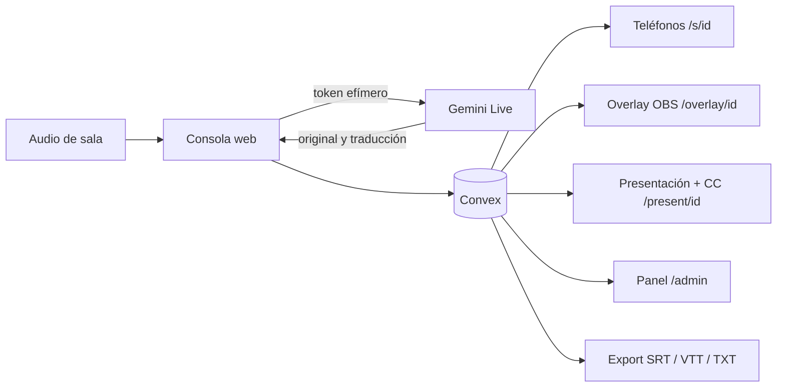

# LinguaStream

[English version](README.en.md)

Subtítulos y traducción en vivo para conferencias, construidos con Next.js, Convex y Gemini Live. Cada sala envía audio desde una consola web; el público recibe el texto en tiempo real desde su teléfono y producción puede incorporarlo a un proyector, OBS, vMix o al stream del evento.

El proyecto permite operar varias charlas sin entregar la clave de Gemini a las laptops de sala. Convex crea tokens efímeros, guarda las líneas finales y distribuye las actualizaciones en tiempo real.

## Qué incluye

- Consola de sala con selección de micrófono o audio de una pestaña, vúmetro, pausa y reconexión automática.
- Subtítulos originales y traducciones en español, inglés y portugués.
- Vista accesible con tamaño de texto, contraste, lectura en voz alta y enlace a intérprete de señas.
- Eventos que agrupan sesiones y glosarios aislados por evento o charla.
- Panel de producción con estado, latencia, errores, líneas y estimación de espectadores web.
- Overlay transparente para OBS/vMix y una salida que combina diapositivas con CC.
- Exportación TXT, SRT y WebVTT.

## Arquitectura



La implementación abre una conexión Gemini por idioma de salida. La primera conexión también entrega la transcripción original. Esta diferencia importa para calcular capacidad y costo.

## Requisitos

- Node.js 22 y npm 10 o posterior.
- Una cuenta y un proyecto de [Convex](https://www.convex.dev/).
- Una clave de [Gemini Developer API](https://ai.google.dev/gemini-api/docs/api-key).
- Chrome o Edge para captura de audio y pantalla.

## Puesta en marcha

```bash
git clone https://github.com/Letalc/LinguaStream.git
cd LinguaStream
npm install
npx convex dev
```

La primera ejecución de Convex pide iniciar sesión y elegir o crear un proyecto. También escribe `NEXT_PUBLIC_CONVEX_URL` en `.env.local`. En otra terminal, configurá los secretos del deployment de desarrollo:

```bash
npx convex env set ADMIN_PASSWORD
npx convex env set GEMINI_API_KEY
```

El CLI solicita cada valor sin necesidad de guardarlo en el repositorio. No uses una clave real en archivos versionados. Para los QR en un teléfono de la misma red, agregá una URL que ese teléfono pueda abrir:

```dotenv
NEXT_PUBLIC_PUBLIC_URL=http://192.168.1.50:3000
```

Después iniciá la aplicación:

```bash
npm run dev
```

Abrí `http://localhost:3000/admin`, ingresá la contraseña, creá un evento y luego una sesión. La consola de cada sala aparece en `/console/[sessionId]`.

## Salidas para público y producción

- `/s/[sessionId]`: vista personal para celulares y computadoras.
- `/share/[sessionId]`: QR y código de sala para el proyector.
- `/present/[sessionId]`: el operador elige una ventana, pestaña o pantalla y la página superpone los subtítulos.
- `/overlay/[sessionId]?lang=es&size=42&lines=2&bg=1`: Browser Source transparente para OBS/vMix. `bg=0` quita el recuadro y `color=ffffff` cambia el color hexadecimal.

Para un stream con cámara y diapositivas, producción mezcla esas fuentes en OBS/vMix y añade `/overlay/...` como Browser Source. La aplicación no controla el botón CC de una plataforma externa; ese botón depende de que la plataforma admita una pista de subtítulos. El overlay permite quemarlos en el video para que todos los espectadores los vean.

## Docker

Docker levanta el frontend y lo conecta a un deployment de Convex existente; no reemplaza el backend administrado de Convex.

```bash
cp .env.example .env.local
# completá las variables públicas
docker compose --env-file .env.local up --build
```

Los secretos `ADMIN_PASSWORD` y `GEMINI_API_KEY` se configuran con `npx convex env set`; no se incluyen en la imagen.

## Pruebas

```bash
npm test
npm run lint
npx tsc --noEmit
npm run build
```

La suite local simula 3 y 10 salas aisladas, 30 minutos con cortes cada cinco minutos, toma de control de consola, EN/ES/PT, parciales/finales y glosarios. Usa tiempo virtual y un transporte Gemini falso: demuestra la lógica de la aplicación, pero no certifica latencia ni disponibilidad del proveedor. El estado completo está en [docs/VALIDATION.md](docs/VALIDATION.md).

## Prueba real y costo

`scripts/simulate-room.ts` acepta archivos WAV mono de 16 kHz y usa los servicios reales:

```bash
ADMIN_PASSWORD='...' npx tsx scripts/simulate-room.ts charla-en.wav:en:es charla-es.wav:es:en,pt
```

`DROP=1` fuerza una reconexión. Cada archivo adicional abre otra sala y cada idioma de destino abre otra conexión Gemini, por lo que esta prueba puede generar consumo pago. No la ejecutes sin revisar el presupuesto.

Al 25 de septiembre de 2026, Google publica un precio efectivo aproximado de **USD 0,0368 por minuto por conexión** para `gemini-3.5-live-translate-preview`: cerca de **USD 2,21 por hora con un idioma de salida** o **USD 4,42 por hora con dos**. Verificá siempre la [tabla oficial](https://ai.google.dev/gemini-api/docs/pricing), porque el modelo es preview. Convex, transferencia y streaming se calculan aparte.

## Escala y audiencia

El contador representa navegadores conectados a la vista web; no incluye personas que miran un video con los subtítulos incorporados. Es una señal operativa, no un conteo de asistentes únicos. Antes de una conferencia masiva hay que probar el plan elegido y revisar los [límites de Convex](https://docs.convex.dev/production/state/limits). La asistencia total del evento no equivale a conexiones simultáneas a esta aplicación.

## Estado

El núcleo y las pruebas offline están implementados. Quedan pendientes las certificaciones con servicios reales: audio EN/ES, latencia, una ejecución continua de 30 minutos, OBS/vMix, VLC y una prueba de carga sobre el plan definitivo. No hay deploy incluido en este flujo.

Licencia [MIT](LICENSE).
