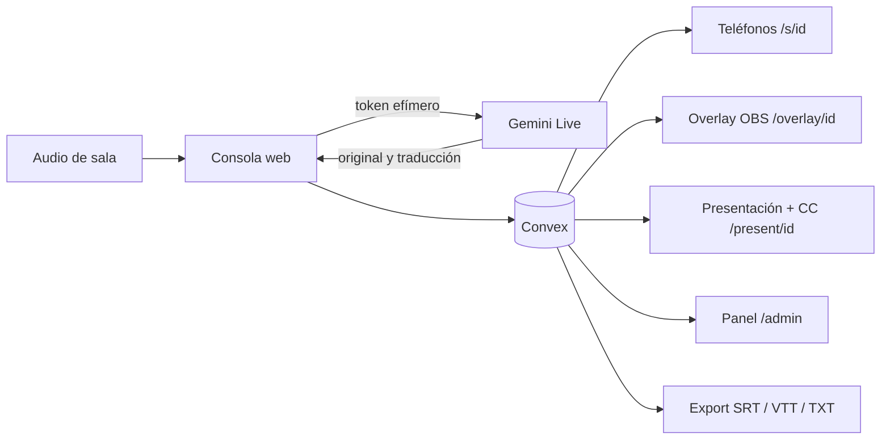

# LinguaStream

[English version](README.en.md)

**Demo en vivo:** https://linguastream-ten.vercel.app · el panel `/admin` tiene un botón **Entrar como demo** (hasta 3 salas en vivo, 20 minutos por sesión).

Subtítulos y traducción en vivo para conferencias, construidos con Next.js, Convex y Gemini Live. Cada sala envía audio desde una consola web; el público recibe el texto en tiempo real desde su teléfono y producción puede incorporarlo a un proyector, OBS, vMix o al stream del evento.

El proyecto permite operar varias charlas sin entregar la clave de Gemini a las laptops de sala. Convex crea tokens efímeros, guarda las líneas finales y distribuye las actualizaciones en tiempo real.

## Qué incluye

- Consola de sala con selección de micrófono o audio de una pestaña, vúmetro, pausa y reconexión automática.
- Subtítulos originales y traducciones en español, inglés y portugués.
- Ingreso por QR o código de 4 letras, con un popup para elegir idioma (Español, English, Português) o el modo accesible.
- Modo accesible para personas sordas o con hipoacusia (ver [Accesibilidad](#accesibilidad)).
- Lectura en voz alta de la traducción que siempre va al presente: si se atrasa, descarta lo viejo en lugar de acumularlo.
- Eventos que agrupan sesiones y glosarios aislados por evento o charla. El glosario se puede extraer con IA desde la presentación de la charla (PDF o link de Google Slides).
- Panel de producción con embudo (en vivo, con problemas, programadas, finalizadas), alertas en vivo, estado, tiempo, latencia, errores, líneas y estimación de espectadores web. Las charlas terminadas se archivan en una carpeta con descargas por idioma.
- Overlay transparente para OBS/vMix y una salida que combina diapositivas con CC.
- Exportación TXT, SRT y WebVTT.

## Arquitectura



La implementación abre una conexión Gemini por idioma de salida. La primera conexión también entrega la transcripción original. Esta diferencia importa para calcular capacidad y costo.

## Requisitos

- Node.js 22 y npm 10 o posterior.
- Una cuenta y un proyecto de [Convex](https://www.convex.dev/).
- Una clave de [Gemini Developer API](https://ai.google.dev/gemini-api/docs/api-key).
- Chrome o Edge para captura de audio y pantalla.

## Puesta en marcha

```bash
git clone https://github.com/Letalc/LinguaStream.git
cd LinguaStream
npm install
npx convex dev
```

La primera ejecución de Convex pide iniciar sesión y elegir o crear un proyecto. También escribe `NEXT_PUBLIC_CONVEX_URL` en `.env.local`. En otra terminal, configurá los secretos del deployment de desarrollo:

```bash
npx convex env set ADMIN_PASSWORD
npx convex env set GEMINI_API_KEY
```

El CLI solicita cada valor sin necesidad de guardarlo en el repositorio. No uses una clave real en archivos versionados. Para los QR en un teléfono de la misma red, agregá una URL que ese teléfono pueda abrir:

```dotenv
NEXT_PUBLIC_PUBLIC_URL=http://192.168.1.50:3000
```

Después iniciá la aplicación:

```bash
npm run dev
```

Abrí `http://localhost:3000/admin`, ingresá la contraseña, creá un evento y luego una sesión. La consola de cada sala aparece en `/console/[sessionId]`.

## Deploy

La instancia pública corre en **Vercel** (frontend) y **Convex Cloud** (backend):

```bash
# 1. Backend: sube funciones, esquema y crons al deployment de producción
npx convex env set --prod ADMIN_PASSWORD
npx convex env set --prod GEMINI_API_KEY
npx convex env set --prod DEMO_MODE true   # opcional: habilita el botón "Entrar como demo"
npx convex deploy

# 2. Frontend: proyecto de Vercel conectado al repositorio
vercel env add NEXT_PUBLIC_CONVEX_URL production       # https://<deployment>.convex.cloud
vercel env add NEXT_PUBLIC_CONVEX_SITE_URL production  # https://<deployment>.convex.site
vercel --prod
```

`vercel.json` fija el framework en Next.js. Con el repositorio conectado, cada push a `master` publica el frontend; el backend se sube aparte con `npx convex deploy` (antes del push si cambia `convex/`). En producción no hace falta `NEXT_PUBLIC_PUBLIC_URL`: los QR usan el dominio del sitio.

## Accesibilidad

Al escanear el QR, el público elige su idioma o **Accesible · personas sordas o con hipoacusia**. El modo accesible ofrece:

- Letra muy grande con [Atkinson Hyperlegible](https://www.brailleinstitute.org/freefont/), 3 combinaciones de alto contraste y foco en las últimas 3 líneas.
- **Pausar para releer** toda la charla y volver al vivo con un toque.
- Indicador visual **Hablando / Silencio**, y avisos de pausa, fin o reconexión, para que una pantalla quieta nunca sea ambigua.
- Video del **intérprete de lengua de señas (LSA)**: la consola de sala acepta un link (YouTube u otro embebible) y el público lo ve arriba de los subtítulos. Es un intérprete humano provisto por el evento; no se genera con IA.
- **Vibración** al empezar, pausar y terminar la charla (Android; Safari en iOS no permite vibrar desde la web).

## Operar varias salas

- Desde el panel, **Consola** abre cada sala en su **propia ventana** y el panel queda en su pestaña. Volver a tocarla enfoca esa ventana sin recargarla.
- La consola es la que captura el audio y mantiene las conexiones con Gemini: si se cierra, la charla se corta. Mientras transmite, **← Panel** abre el panel en otra pestaña y cerrar o recargar pide confirmación.
- Permití las ventanas emergentes del sitio en el navegador de producción. Mantené cada consola en una ventana visible (no en una pestaña oculta), porque los navegadores ralentizan las pestañas en segundo plano.
- Elegí bien el idioma **Habla en** al crear la sesión: si el orador habla en español y la sesión dice English, Gemini no puede traducir español a español y ese idioma queda vacío.

## Salidas para público y producción

- `/s/[sessionId]`: vista personal para celulares y computadoras.
- `/share/[sessionId]`: QR y código de sala para el proyector.
- `/present/[sessionId]` (**Presentación + CC**): abrila en la compu del proyector, tocá **Elegir presentación**, seleccioná la ventana de las diapositivas (PowerPoint, Keynote, Google Slides) y después **Pantalla completa**. La página muestra las diapositivas con los subtítulos encima; el idioma se cambia arriba. La consola de la sala tiene que estar transmitiendo.
- `/overlay/[sessionId]?lang=es&size=42&lines=2&bg=1`: Browser Source transparente para OBS/vMix. `bg=0` quita el recuadro y `color=ffffff` cambia el color hexadecimal.

Para un stream con cámara y diapositivas, producción mezcla esas fuentes en OBS/vMix y añade `/overlay/...` como Browser Source. La aplicación no controla el botón CC de una plataforma externa; ese botón depende de que la plataforma admita una pista de subtítulos. El overlay permite quemarlos en el video para que todos los espectadores los vean.

## Docker

Docker levanta el frontend y lo conecta a un deployment de Convex existente; no reemplaza el backend administrado de Convex.

```bash
cp .env.example .env.local
# completá las variables públicas
docker compose --env-file .env.local up --build
```

Los secretos `ADMIN_PASSWORD` y `GEMINI_API_KEY` se configuran con `npx convex env set`; no se incluyen en la imagen.

## Pruebas

```bash
npm test          # requiere Node.js 22 (vitest no arranca con Node 20.17)
npm run lint
npx tsc --noEmit
npm run build
```

La suite local simula 3 y 10 salas aisladas, 30 minutos con cortes cada cinco minutos, toma de control de consola, EN/ES/PT, parciales/finales y glosarios. Usa tiempo virtual y un transporte Gemini falso: demuestra la lógica de la aplicación, pero no certifica latencia ni disponibilidad del proveedor. El estado completo está en [docs/VALIDATION.md](docs/VALIDATION.md).

## Prueba real y costo

`scripts/simulate-room.ts` acepta archivos WAV mono de 16 kHz y usa los servicios reales:

```bash
ADMIN_PASSWORD='...' npx tsx scripts/simulate-room.ts charla-en.wav:en:es charla-es.wav:es:en,pt
```

`DROP=1` fuerza una reconexión. Cada archivo adicional abre otra sala y cada idioma de destino abre otra conexión Gemini, por lo que esta prueba puede generar consumo pago. No la ejecutes sin revisar el presupuesto.

Al 25 de septiembre de 2026, Google publica un precio efectivo aproximado de **USD 0,0368 por minuto por conexión** para `gemini-3.5-live-translate-preview`: cerca de **USD 2,21 por hora con un idioma de salida** o **USD 4,42 por hora con dos**. Verificá siempre la [tabla oficial](https://ai.google.dev/gemini-api/docs/pricing), porque el modelo es preview. Convex, transferencia y streaming se calculan aparte.

### Cuota de Gemini: cuántas salas en simultáneo

Cada sala abre **una conexión Gemini Live por idioma de salida**, así que una sala EN → ES + PT usa 2 conexiones. Gemini limita las sesiones Live **concurrentes por proyecto** según el nivel de la cuenta:

- **Probado:** 3 salas en simultáneo durante 30 minutos, con 6 reconexiones forzadas por sala, sin errores de cuota ([resultado](test-results/real-3-room-30m-2026-09-25.md)).
- **Aviso en la consola:** `Resource has been exhausted (e.g. check quota)` significa que Gemini rechazó una conexión por cuota; la consola reintenta sola y el aviso pasa a gris cuando se recupera.
- **Límite observado:** con 10 salas, Gemini rechazó parte de las conexiones (WebSocket 1011) por la cuota concurrente del proyecto ([registro](test-results/real-load-2026-09-25.json)).

Para un evento con más salas: revisá los límites de tu proyecto en [Google AI Studio](https://aistudio.google.com/) → Rate limits, pedí un aumento de cuota o subí de nivel de facturación, y hacé una prueba escalonada antes del evento.

## Escala y audiencia

El contador representa navegadores conectados a la vista web; no incluye personas que miran un video con los subtítulos incorporados. Es una señal operativa, no un conteo de asistentes únicos. Antes de una conferencia masiva hay que probar el plan elegido y revisar los [límites de Convex](https://docs.convex.dev/production/state/limits). La asistencia total del evento no equivale a conexiones simultáneas a esta aplicación.

## Estado

Desplegado y validado con servicios reales: EN → ES/PT y ES → EN, latencia de ~1 s para el original y ~2,5 s para la traducción después de cada frase, 3 salas durante 30 minutos con reconexiones, aislamiento entre salas y exportación SRT abierta en VLC. Detalle en [docs/VALIDATION.md](docs/VALIDATION.md). El número de salas simultáneas depende de la cuota de Gemini (ver arriba).

Licencia [MIT](LICENSE).
